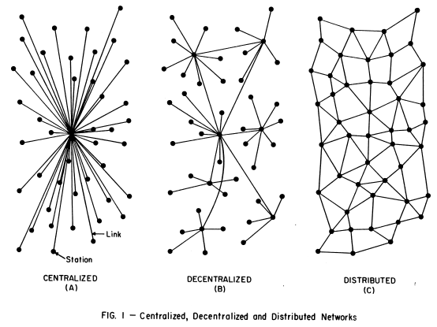
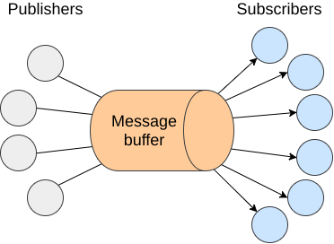
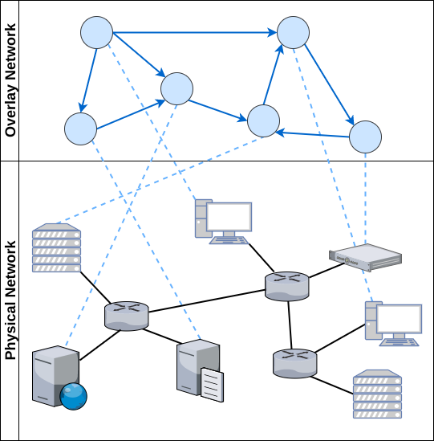
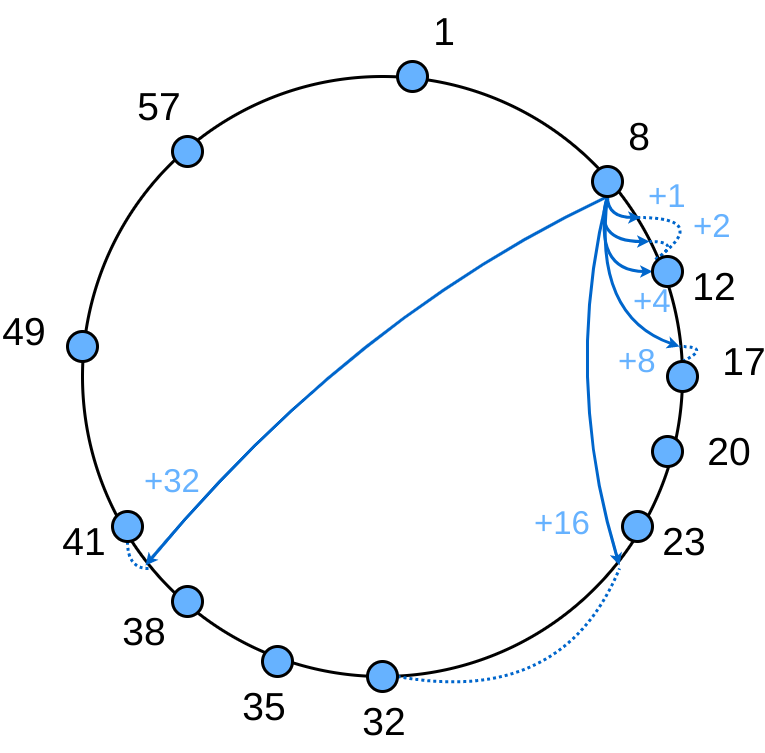
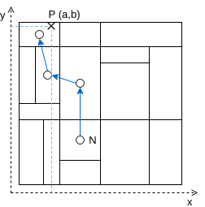
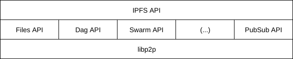
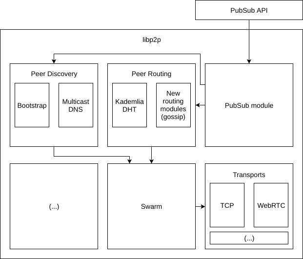

# 1 Introduction

The publish-subscribe (pub-sub) interaction paradigm is an approach that has received an increasing amount of attention recently (TODO ref to XL pubsub and many face of pubsub). This is mainly due to its special properties, that allow for full decoupling of all the communicating parties. First we should define what the publish-subscribe pattern is. In this interaction paradigm, subscribers (or consumers) sign up for events, or classes of events, from publishers (or producers) that are subsequently asynchronously delivered. Taking a closer look at this definition one can see that this comes hand in hand with the way information is consumed nowadays, with the exponential growth of social networks like Twitter and the usage of feeds such as RSS.

The previously discussed decoupling can be broken in three different parts. The decoupling in time, space and synchronisation.  The time decoupling comes from the fact that publishers and subscribers do not need to be actively interacting with each other at the same time; this means that the publisher can publish some events while the subscriber is disconnected and the subscriber can be notified of an event whose publisher is disconnected. Space decoupling gives both parties the benefit of not needing to know each other in order to communicate, given that consumers and producers are focused on they are specific roles (consuming/producing) and do not care for who is doing what, or how many producers are for example. Synchronization decoupling is a consequence of the asynchronous nature of the pub-sub pattern, as publishers do not need to be blocked while producing events and subscribers can be asynchronously notified. The decoupling that this kind of system offers makes it the ideal candidate for very large networks that need a way to communicate in a efficient way. 

Due to the properties described above, a lot of applications rely on the publish-subscribe paradigm and a lot of work as been done by companies like Twitter (TODO reference to https://www.infoq.com/presentations/Twitter-Timeline-Scalability) and LinkedIn into making these systems highly scalable, with the creation of tools like Kafka (TODO reference to http://kafka.apache.org/documentation/#design), which aim at guaranteeing low latency and high event throughput. Other examples are the multiple message queue systems like Apache Active MQ (TODO reference to http://activemq.apache.org/), RabbitMQ (TODO reference to https://www.rabbitmq.com/), Redis (TODO reference to https://redis.io/topics/pubsub), etc. These solutions are, of course, centralised and as such suffer from all the common issues that affect centralised solutions: it is quite hard to maintain and scale these systems to a large number of clients. Peer-to-Peer networks on the other hand, have proven numerous times, that this is where they shine, with examples such as Gnutella, Skype and most recently IPFS (TODO reference to IPFS). All of these systems are a living proof of the high scalability P2P can offer, with pub-sub systems over P2P networks being an active research topic with a lot of attention. 

(TODO Document Roadmap)

## 2 Objectives

As we are going to cover in the next sections, lots of different solutions exist in the field. However, most of them either rely on a centralised or hierarchic network to have a reliable system, with stronger delivery and persistence guarantees, or end up sacrificing these same properties in order to have a decentralised system with the potential to scale to a much larger network.

The solution we propose is a pub-sub module to IPFS with a strong focus on reliability, delivery guarantees and data persistence, while maintaining the ability to scale to a vast number of users, using the network infrastructure we have in place today. There is also, to the best of our knowledge, a lack of pub-sub systems with such a strong focus on persistence, which is something our solution does.

# 3 Related Work

(TODO intro section)

## 3.1 Distributed Publish-Subscribe Paradigm

(TODO intro section)

### 3.1.1 Subscription Model

When considering pub-sub systems, there is a set of different options that will lay ground for the behaviour of the whole system. We call these options, design dimensions. Specifically, in our case, one  of the biggest decisions when designing a pub-sub system is what kind of subscription model to use.The subscription model determines how subscribers will define which events they are interested in. There are three major approaches covered by relevant literature (TODO reference many faces of pubsub and  XL PubSub) and that implementations usually follow:

  * Topic based subscriptions
  * Content based subscriptions
  * Type based subscriptions

**Topic based subscription model** employs, as the name states, the notion of topics or subjects to allow participants to subscribe to relevant content. These topics are identified by keywords and can be naturally viewed as a group or a channel to which participants can send messages (publish) and receive messages (subscribe). This approach was one of the earliest models in the pub-sub paradigm, with references (TODO reference to TIBCO?), mainly due to its similarity with the group communication systems already in place at the time. Some examples of the topic based approach allow to build a topic hierarchy. A specific one is using a UNIX path like approach, which allows to build topic hierarchy just like paths in a file system. Consider as an example:

```
/fruits
/fruits/citrus
/fruits/citrus/orange
```

The list above is an example of 3 topics, that act as 3 different tiers on a hierarchy. This allows for specialisation and the possibility to extend the subscription structure already in place. There are numerous solutions that cover the topic based subscription scenario. Specifically in the distributed/decentralised area we have solutions like Scribe (TODO reference Scribe), Bayeux (TODO reference Bayeux), Tera (TODO reference Tera) and Poldercast (TODO reference Poldercast).

The **content based subscription model** brought a different approach that sought to use the content of the event message itself as a way for subscribers to specify the messages they were interested in (TODO reference "An Efficient Multicast Protocol for Content-Based Publish-Subscribe Systems"). Essentially, subscribers could define fields, or conditions on those same fields that would make an event match a subscription or not. Consider the following example of a simple message and subscription, represented using JSON (TODO reference to JSON).

Message
```
{
  exchange: "Euronext Lisboa",
  company: "CTT",
  order: "buy",
  number: "100",
  price: "5.55",
}
```

Subscription
```
{
  exchange: "Euronext Lisboa",
  order: "buy",
  number: ">50",
  price: "<10",
}
```
The example above translates into a subscription to a stock exchange pub-sub system, where the client would receive all the event messages for buy orders of more than 50 stock actions for a maximum price of 10€. The notion of subscription is much more complex in this model, but allows for a much more powerful, expressive and  accurate message filtering. Usually, in order to implement this, systems rely on the definition of schemas as a way to create subscriptions. Some examples of solutions that follow a content based subscription model are Gryphon (TODO reference Gryphon), Jedi (TODO reference Jedi), Siena (TODO reference Siena), Meghdoot (TODO reference Meghdoot), Mercury (TODO reference Mercury) and Sub-2-sub (TODO reference Sub-2-sub). 

Also worth referencing is the **type based subscription model**. (TODO reference to Eugster). The type based model seeks to use the type scheme of a programming language without introducing a topic hierarchy. Instead it focuses on the idea that, in practice, messages part of the same topic usually are of the same type and notify the same kind of event. As such we can rely on a straightforward type-safe interpretation of messages belonging to the same topic, since most topic based systems only offer, at most, weakly typed interfaces. This, of course, comes quite handy when working with strongly typed languages such as Java and C++. One other aspect also worth mentioning is that, similar to topic based systems, the type based system also offers a notion of hierarchy through sub-typing. In this area, Hermes (TODO reference Hermes) is a reference system implemented on top of a distributed network.

While looking back at these different models its crucial to understand how they are tied to the expressiveness of the system as a whole. Choosing a topic based subscription model will allow for an easier implementation when it comes to message filtering at each node, but it will clearly affect the capabilities of the system. On the other end, a content based subscription model allows for a lot more expressiveness in subscription definition, but it makes it a lot harder to implement a scalable way of filtering messages. It is also important to note that these three categories are not strict distinct models, but somewhat fluid and subject to hybridisation, as is quite possible to have solutions in between, such as content based filtering through the use of special topics, or content based filtering only for pre-set fields. As such, not all approaches are easy to categorise and, for some specific scenarios and systems, the line is quite thin between the multiple subscription models.

It is also interesting to look at the application space and notice that not all applications have the same expressiveness requirements. This makes the existence of multiple subscription models not only justifiable but required. Consider the example given above for a stock exchange system: these kind of applications have a need for a complex set of subscription patterns, quite different from the ones you would probably have for a chat or social media application, which would rely heavily in the notion of topics and groups. 

### 3.1.2 Network Architecture 

Independent of the subscription model used, the system approach to the network architecture is crucial as it will, not only set the way clients interact with it, but will also determine a lot of the properties that the solution will benefit from (such as scalability, reliability, etc.).

Based on the early work of Baran (TODO ref to Paul Baran paper), one can categorize networks in centralised, decentralised and distributed.



Note that the goal of a pub-sub system is to permit the exchange of events in a asynchronous manner, with the decoupling of producers from consumers as previously discussed. This can be easily achieved using an entity which is responsible for receiving the messages from the producers, storing it and distributing it through the consumers. This is what we refer to as a centralised architecture, motivated by the need of this central entity. This is the approach adopted by a lot of the message queue systems like Apache Active MQ, RabbitMQ and Redis. The usual focus for applications relying on this kind of systems is on reliability and data consistency but with a low data throughput.



The asynchronous needs of the pub-sub paradigm also allow for a different approach on message forwarding, with both producers and consumers being responsible for storing and forwarding messages, without the need of a intermediary entity. This approach is referred to as a distributed architecture as there is no central entity that could easily become a bottleneck for the whole system. It is also commonly referred to as peer to peer architecture, for it relies on the communication between peers in the same network. (TODO reference for a distributed system). These kind of systems have a great focus on scalability and, consequently, on efficient message delivery.

Finally we have hybrid approaches to both of these extremes, were we rely on a distributed network of servers making the network topology resemble more of decentralised network as showed in figure (TODO figure number). This is the approach followed by systems like Gryphon (TODO reference for Gryphon system), Jedi (TODO reference for Jedi system) and Siena (TODO reference for Siena system), which rely on a network of broker nodes to perform the work of persisting and distributing the events in a reliable fashion.  
### Overlay structure

Working with a P2P architecture has its own set of challenges. When we rely on the communication between peers we need a way to create and maintain links between multiple nodes in a network. Hence the overlay networks. The idea is to have a structure of logical links and nodes, independent of the physical network beneath them that actually powers the communications through. Unlike traditional layer-3 networks, the structure of these overlays is not dictated by the fairly statical physical topology (presence and connectivity of hosts), but by logical relationships between peers. This way we have the potential to manipulate the logical network at the application level, without needing to change the network backbone that connects the nodes. This approach was key to deploy P2P applications such as (TODO give P2P application examples) on top of the existing Internet infrastructure.



In practical terms, each node maintains a view of its neighbours in the overlay network, which translates into the communication links between them. There are different approaches to the way this state is stored and maintained, with two main categories dominating the P2P ecosystem. At one end of the spectrum we have the **unstructured overlay** networks, where peers form a network with no clear structure or hierarchy (commonly referred to as a network mesh) with each peer connected to a subset of other nodes independent of their ID, localisation, network IP address, etc.

**Unstructured overlays**: These rely on membership protocols that try to preserve a couple of key properties, such as the network diameter and its average degree. A great amount of these membership protocols use gossip based (also referred to as epidemic) approaches in order to do this. These approaches exploit properties that arise when information is disseminated in a random, or close to random, way. These probabilistic approaches help keeping the overlay connected in the event of network failures.

One relevant example is Cyclon (TODO reference to Cyclon), a membership protocol that uses a gossip based approach to help maintain a network which resembles a random graph (TODO reference to random graph paper) in terms of degree distribution, clustering coefficient and path length. In order to do this, the approach followed by Cyclon is, at each node, besides keeping a fixed size of neighbours (other nodes in the network), to also keep information on when for the last time that node was contacted. Periodically, each node contacts the oldest node of its neighbours (i.e. the node which has been the longest time without being contacted) and shares with it a fixed size partial list of its neighbours, to which the contacted peer replies back with its own partial view of its neighbours. Each node updates its neighbours list with the new info (either by filling empty cache slots or by replacing entries that were sent in the previous contact). It is also worth noting that during this exchange, the node that initiated the contact will drop the contacted node of its neighbour list, as the contacted node will inversely add the node that established contact to his. This way we end up with a uniform and organic way to disseminate node information across the network. This approach is based on a technique named shuffling (TODO reference to shuffling).

The unstructured overlay has an interesting set of properties, such as its ability to accommodate for a highly dynamic network with a high resilience to network failures and churn (i.e. high volumes of changes in network participants). However, the lack of structure in the network usually limits the kind of queries for content one can run through. The delivery of messages in the network will always follow a probabilistic best effort approach. Finally, unstructured gossip based approaches rely on a pre-set of conditions that, if not met accordingly, may affect the whole behaviour of the system (TODO reference to "How robust are gossip-based communication protocols?"). For example, the selection of neighbours is a key aspect and should assume a random or pseudo-random fashion. If disturbed by a small set of nodes that could either be malfunctioning or behaving selfishly, the basic properties of the network like its resilience could be severely affected.

**Structured overlays**: On the other end of the spectrum of overlay networks we have the **structured overlay**, where peers are organised according to a specific structure, like a ring, a tree or a multi-dimensional space. This is usually achieved by imposing constraints on how the nodes should be organised based on their identifiers. In order to do this, a common approach is to think of the ID space as a hash table to where the content should then be distributed. The distribution of content is then done based the value of the keys generated for each piece of information, keys with values close to a node ID will be stored in that node. This is commonly referred to as a Distributed Hash Table (or DHT for short), since the key space is distributed across multiple nodes. For example, **Chord** (TODO reference to chord), one of the first examples of a DHT, organises the nodes in a ring like structure based on their ID (which results from the SHA-1 hash of its ip adress). The content is then distributed in this key space, using the same hashing function to produce the content key that was used to produce the node ID.



It is common for Distributed Hash Tables to have a cost of O(log(N)) (TODO need to use math notation here) in terms of number of nodes contacted, on average, to search for a given key (where N is the number of nodes in the network). Chord base structure per se only gives us O(N), as such, Chord uses a mechanism to allow for a speedier search. At each node, an additional routing table is kept with m entries, where m is the number of bits in the key space. Each ith entry in this table will be this node's successor (next node in the ring in a clockwise direction) with an ID, at least, bigger than 2^i-1 (modulo 2^m) in the key space. For example, for a node with ID 8, the 4th entry will be the first node in the ring with an ID larger than 16. This table, also referred to as finger table, will allow for a logarithmic search as demonstrated in Chord's specification.

Another approach is followed by **Kademlia DHT** (TODO reference to paper). Just as in Chord, nodes have 160 bit identifiers and content is stored in the nodes whose IDs are close to the content key (160 bit identifiers too), but the way the routing tables are structured and maintained is quite different. For starters, Kademlia relies on a XOR based distance metric between 2 keys, where the distance between 2 keys is the resulting bitwise XOR operation interpreted as an integer. The XOR metric gives us an interesting set of properties. It is unidirectional (just like Chord clockwise direction) ensuring that lookups for the same key converge along the same path but, unlike Chord, it is symmetric, as such, the distance between x and y is the same as the distance between y and x. This symmetry allows Kademlia queries to give valuable insights along every node they go through, helping out in populating each node's routing table.

Kademlia nodes keep contact information about each other in a list, size m where m is the number of bits used for the keys in the system, and where each entry is a list itself of maximum size k (a system wide parameter) containing all the known nodes of distance between 2^i and 2^i+1 of itself. These lists are appropriately called k-buckets and are kept sorted by time last seen (least recently seen node at the head). Whenever a node receives a message, it updates the appropriate k-bucket for the sender's node ID, inserting it in the respective k-bucket or moving it to the tail of the list if it is already there. K-buckets aim at implementing a least-recently seen eviction policy, where live nodes are never removed. This stems from a careful analysis of Gnutella trace data (TODO reference to paper) where the longer a node has been up, the more likely it is to remain up for another hour. Whenever a node wants to retrieve or store content it uses a recursive node lookup procedure in order to find the k closest nodes to a given key. This lookup can be run with multiple queries in parallel, because nodes have the flexibility to forward messages to any of the k nodes in a bucket, aiming for lower latency.

A completely different method is used in the **Content Addressable Network DHT** (TODO reference to paper). In CAN, the key space used to address the content stored in the DHT is a virtual d-dimensional Cartesian coordinate space. In order to store and retrieve content, the generated keys use a uniform hashing function that maps the key into the d-dimensional space, resulting in a point. The overall space is split into different areas referred to as zones. Each node is responsible for a zone and, consequently, for all the keys stored in that zone. Retrieving a key can be done by calculating its corresponding point in the d-dimensional space and, if the point does not belong to this node space or any of its neighbours (nodes responsible for adjacent zones) it can be routed through CAN infrastructure in order to find the node responsible for storing the key. Intuitively, routing in CAN works by following the straight line from the source to the destination coordinate in the Cartesian space. In practice this is done by forwarding the message to the neighbour closest to the destination coordinate. Interestingly enough, the usage of a multidimensional space as the key space for the DHT, makes the distance metric in the CAN DHT as a simple Cartesian distance between two points. 



Other popular examples in the DHT field are **Pastry** and **Tapestry** (that we kept out for the sake of simplicity, although a lot of the mechanisms described above apply to these). DHTs present a set of interesting benefits, such as good routing performance (usually logarithmic in the number of nodes), the limited size of state kept at each node (usually logarithmic routing tables), a better support for exact match and other complex queries and also present stronger guarantees on  message delivery. If the hashing function is properly selected it can also be ensured that the load is balanced properly across the network. However, these networks lack the tolerance for heavy network partitions and network churn that the usual unstructured network can bare with. 

**Hybrid overlays**: As with everything discussed so far, not every solution lies in each end of the spectrum, and overlay structure is no different. Recent research has been pushing more and more towards hybrid solutions that take advantages of both sides. Such example is **Vicinity** (TODO reference to paper) which employs Cyclon (discussed above) as a peer sampling service to help out in building an ideal structure that links nodes based on their proximity (for some notion of proximity, e.g. latency, localisation, etc.). In the end, we get a structured overlay, generated from a unstructured, gossip based, overlay (hence the hybrid solution). More importantly, this overlay will have properties that guarantee that it is an almost ideal structure for a given proximity metric. The Vicinity system discusses that the usage of probabilistic mechanisms helps out in keeping an healthy and reliable structure.

### 3.1.3 Subscription Management and Event Dissemination.

Now that we have set the underlying structures that power up the network, it is time to cover the specific requirements of a pub-sub system. We have two different aspects to cover: subscription management and event dissemination. By subscription management we refer to a set of key factors that will determine the overall performance of the pub-sub system, specifically in terms of matching events with subscribers, the selected representation for subscriptions, registering new subscriptions and deleting subscriptions. Event dissemination dictates how will the events be propagated through the system, in a way that avoids burdening specific nodes, but assures that all the subscription requirements are met. It is natural that in some ways these two aspects are connected (e.g. the way we store our subscriptions will probably impose a set of restrictions in how our events will be propagated) but it is still possible to make a clear distinction between how they work and their role in the overall system. 

As discussed before, in order to match subscribers with publishers, some kind of state must be kept (what we refer as subscriptions). There are plenty of ways of doing this and factors like network architecture and subscription model come into play here. For a system with a centralised architecture, this is not such a big challenge, since the central nodes will be responsible for keeping and managing the state, matching events with the correct subscribers and making sure the event propagation works accordingly. However, in a distributed or a decentralised scenario, this is not such a trivial problem to solve.

One interesting property of topic based systems in a decentralised and distributed scenario is that their subscription management and event dissemination can be easily implemented with an application level multicast system if we cluster subscribers of some topic/group in a single structure (e.g. a multicast tree). For example, consider the topic `/foobar` issued by a particular node in a pub-sub system. If , when new subscriptions are issued to this node, a tree like structure is built that allows events related to this topic to flow accordingly, disseminating a new event in `/foobar` is just a matter of sending the event to the root of the tree. From there, dissemination can flow blindly through the multiple links. Subscriptions are then represented as simple dissemination trees for each topic, which, interestingly enough, end up also representing how the actual events will be propagated in each topic. The root node (or nodes) acts as a rendezvous which, as the name suggests, it is where events are targeted at and new subscriptions issued to. The core idea is that, by relying on such nodes, eventually, all the system state will be synchronised (all the events will be propagated to the expected nodes and no subscription is left unattended). This does not mean that other nodes cannot cache state though, the idea of the rendezvous is to have a basic reassurance in subscription management and event dissemination. Ideally this would be implemented in a distributed fashion, keeping as much pressure out of the rendezvous node as possible. This is the approach followed by Scribe (TODO reference to Scribe) and Bayeux (TODO reference Bayeux).

The usage of rendezvous nodes and tree like structures to represent subscriptions is not something particular to topic based systems. There are examples of these techniques in content based systems also, specifically Gryphon (TODO reference Gryphon) and Jedi (TODO reference Jedi). Hermes (TODO reference to Hermes) on the other hand is an example of the same mechanisms with a type based subscription model. A more detailed description of how this is done in Gryphon and Scribe will be made further along, since they have different approaches motivated by their different options in network architecture and subscription model.

For content based systems though, a common approach is to use multidimensional spaces as a way to represent subscriptions. The idea is to have each dimension refer to a specific attribute of the pub-sub schema.

```
{
  exchange: String,
  company: String,
  order: String,
  number: Integer,
  price: Float,
}
```

Considering the example above, we could map each of the given attributes to a given dimension and end up with a 5 dimensional space that we could use to route events accordingly. Meghdoot (TODO reference to Meghdoot) is an example of a content based pub-sub system that follows an approach close to this one, using a CAN DHT with 2n dimensions, where n is the number of attributes in the schema. We will cover Meghdoot further down, but it is worth mentioning that are other alternatives to using a multidimensional space DHT to replicate this behaviour. Mercury (TODO reference Mercury) for example relies on the usage of several ring-based DHTs to recreate this multidimensional space and support range queries, using one DHT per attribute.

For topic based systems, an alternative to building dissemination trees that rely on a rendezvous nodes is to consider each different topic as separate overlay. Each set of subscriptions for a topic is then represented as a different network (which can be either structured or

A different approach to managing subscriptions and disseminating events in topic based systems is by having an overlay for each different topic. The idea is that by clustering nodes one can afford an easier event dissemination as well as an easy way of matching events with subscribers, since it is just a matter of propagating a given event inside its overlay. In order to keep everything connected, a general overlay can be used, that will allow all the nodes to have visibility on the whole set of topics. In this scenario, subscriptions are simply represented as being part of a specific network of peers, that could take any form or shape, or even be unstructured. For an unstructured network, the propagation of events could be a simple flooding algorithm, as it happens in Tera. Tera (TODO reference to Tera), a topic based pub-sub system, follows an approach close to this one. It keeps two distinct gossip based overlays, one responsible for keeping state on entrypoints for each topic (peers which are subscribed to a given topic and that can act as dissemination points for it) and another used to keep the subscribers of each topic. This clustering approach, where subscribers of a given topic are kept in a topic specific overlay, helps out in the dissemination step after an event has been published and reached the cluster. Another example following this approach is Poldercast (TODO reference to poldercast), which uses a set of three different overlays to keep the pub-sub network running. We will cover Poldercast more thoroughly later on. 

## 3.2 Relevant Pub-Sub Systems

We now describe in further detail the systems which most resemble the work we are going to do. 

### 3.2.1 Gryphon

Gryphon (TODO reference to Gryphon) is a (TODO centralised?) content based pub-sub system developed at IBM using an interesting approach to match events with subscriptions (TODO reference "Matching events in a content-based subscription system"). Gryphon relied on a distributed broker based network to build a hierarchic tree structure representing the subscription schema. Considering a schema with multiple attributes - A1,...,An - each level on the subscription tree would represent a specific attribute. So, for example, if we were to have an event with a value V1 for the attribute A1, at the root node (which represents the attribute A1) the link followed by the event would be the one that would represent the value V1. The event would then be propagated through the multiple branches of the tree until it arrived at the broker node that represented all the specific values for that event. From there it would then be propagated to all the subscribers registered with that broker node. Figure (TODO reference figure) illustrates this approach.

(TODO Example sketch of the subscription matching system)

When a client issues a new subscription, the same approach will be followed until the subscription arrives at the broker node that represents it. If by some reason, the tree does not have an edge for a specific value of an attribute, a new edge will be created. During both of these approaches (subscription and event propagation), a subscription or event that does not name an attribute at a given level will follow the edge with label * (do not care).

Gryphon has been successfully deployed over the Internet for real-time sports score distribution at the Grand Slam Tennis events, Ryder Cup, and for monitoring and statistics reporting at the Sydney Olympics (TODO reference to https://www.research.ibm.com/distributedmessaging/gryphon.html). In 2001, during the Wimbledon tournament, it managed to withstand almost 100,000 concurrently connected clients.

### 3.2.2 Siena

Siena(TODO reference to Siena) is a content based pub-sub system built on top a centralised broker mesh topology. Siena does not make any assumptions on how the communication between servers and client-server works, as this is not vital for the system to work. Instead, for server to server communication, it provides a set of options ranging from P2P communication to a more hierarchical structure, each with its respective advantages and shortcomings.

Events in Siena are treated as a set of typed attributes with values. Consequently, subscriptions (or *event filters* as they are referred to in Siena) select events by specifying a set of attributes and constraints on its values.

Supports advertisements 

### 3.2.3 Scribe

Scribe(TODO reference to Scribe) is a topic based pub-sub system built on top of a fully decentralised network (P2P). In order to do this it relies on Pastry DHT as its overlay structure. This allows it to leverage the robustness, self-organisation, locality and reliability properties of Pastry. Pastry DHT is at all similar to the DHTs described in the previous section (Chord and Kademlia), with a specific effort on achieving good network locality and a routing mechanism close to that of Kademlia.

Scribe subscriptions are represented by a multicast tree, with each different tree representing a specific topic (or *group* as it is referred in Scribe). The root of this tree acts as the rendezvous node for the group. Each group has a *groupId* assigned to it, as such, the rendezvous node will be the one with the closest ID in the network. This multicast tree is built by joining the multiple Pastry routes from each group member to the rendezvous. This dynamic process happens whenever a new node decides to join a group. In order to do that, it asks Pastry to route a *JOIN* message with the *groupId* as the key. At each node along the path, the Scribe forward method is invoked to check it this node is already part of this group (also called a *forwarder*). If it is, it accepts the *JOIN* request and sets the node as its child, else, this node will become a *forwarder* for the group, sets the requesting node as its child and it sends a *JOIN* request to this group. Note that any node can be a *forwarder* for any group, it does not be an active part of it (i.e. subscriber or publisher).

Disseminating an event in a group is a matter of disseminating it through its respective multicast tree. Fault tolerance mechanisms can be implemented on top of this system but, out of the box, Scribe provides only best effort delivery. As for the rendezvous nodes, their state can be replicated across the k closest nodes in the leaf set of the root node. Whenever a failure is detected by a children, it will issue a *JOIN* message which, thanks to Pastry's properties will be routed to a new root node which has access to the previous state of the rendezvous.

### 3.2.4 Meghdoot

(* more to add *)

### 3.2.5 Poldercast

Poldercast(TODO reference to Poldercast) is a recent pub-sub system with a strong focus on scalability, robustness, efficiency and fault tolerance. It follows a topic based model and follows a fully decentralised architecture. The key detail about this system is that it tries to blend deterministic propagation over a structured overlay, with probabilistic dissemination through gossip based unstructured overlays. In order to do this, Poldercast uses 3 different overlays. Two of them, Cyclon and Vicinity, we covered in the previous section and the third one closely resembles Chord in many ways.

Poldercast subscriptions are represented as a structured ring overlay. Each topic has its own overlay in fact, with all subscribers (and only them) of the corresponding topic connected to it. This overlay is maintained by a module referred to as the *Rings Module* and its overall mechanisms closely resemble Chord's ones. In order for each node to have visibility across the whole pub-sub network, Vicinity, with the help of Cyclon, will be responsible for keeping an updated set of peers participating in each of the available topics in the network. Subscribing to a topic will then be a matter of consulting this set of peers and joining the specific overlay for the topic.

Propagating events will be a matter of forwarding the event through the specific topic overlay. It is important to notice that Poldercast assumes only peers subscribed to a topic can publish to that same topic. The way this propagation works is through the ring overlay that, despite being similar to Chord, it has some important difference. It does not use a finger table at each node to speed up propagation. Instead, with the help of Vicinity, each node keeps a random set of peers for the topics it is part of. With them, whenever a node receives a message from a specific topic, it will propagate the event through a set of these peers. This propagation will be based on a system wide fanout parameter. It will also forward the event to its successor or predecessor (depending where the event originated from), or will simply ignore if it is not the first time it has received it. These mechanisms, depending of the fanout parameter, guarantee average dissemination paths for each topic to be asymptotically logarithmic.

Through the multiple mechanisms described above, Poldercast attempts to provide a set of guarantees. To start with, only nodes subscribed to a topic will receive events published to that topic. In other words, no relay nodes are used. It also focuses on handling churn through the use of a mixture of gossip mechanisms, ensuring an highly resilient network, with a focus on high hit ratio (number of subscriptions covered). Finally, it seeks to reduce message duplication factor (proportional to the fanout parameter) without compromising the network resilience.

### 3.2.6 Systems overview

| Systems / Properties | Subscription Model | Architecture | Topology | Overlay structure | Subscription Management | Event Dissemination | Locality Awareness | Relay Free Routing | Delivery Guarantees | Fault Tolerance | Average Network Degree | Message Duplication Factor | Message Usefulness Ratio |
|----------------------|:------------------:|:------------:|:--------:|:-----------------:|:-----------------------:|:-------------------:|:------------------:|:------------------:|:-------------------:|:---------------:|:----------------------:|:--------------------------:|:------------------------:|
| Gryphon              |                    |              |          |                   |                         |                     |                    |                    |                     |                 |                        |                            |                          |
| Siena                |                    |              |          |                   |                         |                     |                    |                    |                     |                 |                        |                            |                          |
| Jedi                 |                    |              |          |                   |                         |                     |                    |                    |                     |                 |                        |                            |                          |
| Scribe               |                    |              |          |                   |                         |                     |                    |                    |                     |                 |                        |                            |                          |
| Meghdoot             |                    |              |          |                   |                         |                     |                    |                    |                     |                 |                        |                            |                          |
| Hermes               |                    |              |          |                   |                         |                     |                    |                    |                     |                 |                        |                            |                          |
| Rebecca              |                    |              |          |                   |                         |                     |                    |                    |                     |                 |                        |                            |                          |
| PastryStrings        |                    |              |          |                   |                         |                     |                    |                    |                     |                 |                        |                            |                          |
| Tera                 |                    |              |          |                   |                         |                     |                    |                    |                     |                 |                        |                            |                          |
| SpiderCast           |                    |              |          |                   |                         |                     |                    |                    |                     |                 |                        |                            |                          |
| Mercury              |                    |              |          |                   |                         |                     |                    |                    |                     |                 |                        |                            |                          |
| Sub-2-Sub            |                    |              |          |                   |                         |                     |                    |                    |                     |                 |                        |                            |                          |
| Bayeux               |                    |              |          |                   |                         |                     |                    |                    |                     |                 |                        |                            |                          |
| Poldercast           |                    |              |          |                   |                         |                     |                    |                    |                     |                 |                        |                            |                          |

Design dimensions are the design decisions that define how our system works.

- Design dimensions:
  - Subscription model (topic based, content based, etc.) - this directly affects the expressiveness of the system
  - Architecture (centralised, hierarchical, distributed, etc.)
  - Topology (in a distributed scenario, e.g. broker mesh, p2p, ...)
  - Overlay structure (the structure of the overlay(s) used - if any - where unstructered is a specific scenario)
  - Subscription management (representation, propagation?)
  - Event dissemination (routing, propagation)
  
Event dissemination and subscription management in the end might use the same mechanisms.
(?) still need to better define/separate architecture vs topology

Relevant properties are goals/special focuses that systems define as something they want to reach or give. These can be obtained by making the appropriate design decisions (see above).

- Relevant Properties:
  - Topology related:
    - Locality awareness
    - Relay free routing
  - Application related:
    - Delivery guarantees under normal conditions (when the system and network works as expected)
    - Fault tolerance mechanisms (delivery guarantees under churn, ability to keep network overlay structure when relevant nodes (or a great deal of nodes) leave the network)

Relevant metrics are metrics that are a consequence of the design decisions made above and provide a good overview on how well the solution fits a certain usage scenario.

- Relevant Metrics
  - Average network degree
  - Message duplication factor
  - Message usefulness ratio (operational msgs vs actual messages relevant for the applications)

## 3.3  Web Technologies

When building any kind of network focused system nowadays, there is no question that one should take advantage of the full potential that the web has to offer. Browsers are a lot more complex and allow for a vast world of possibilities in terms of applications that can be built on top of it. P2P applications are no exception here. In the next sections we will cover a set of technologies that allow for a modern distributed application to run, not only on the desktops and servers we are used to, but also in browsers running in multiple platforms.

It is indisputable that one cannot think of modern web development without speaking of **Javascript** (TODO reference javascript). Javascript is a lightweight, interpreted, programming language, known as the scripting language for the web. Initially created with the purpose of allowing the creation of simple interactions and animations in web pages it is now one of the main programming languages for the web (TODO reference to stack overflow survey https://insights.stackoverflow.com/survey/2017). It is used, not only for client side programming, but also power server side applications. Since Javascript has different runtimes, it became necessary to create a standardised base from which the multiple browser vendors and runtime maintainers could work from. Hence  ECMAScript (TODO reference ecmascript), the standard for the Javascript implementation. 

As it was previously said, nowadays, Javascript is not restrict to browsers only. **NodeJS** (TODO reference to NodeJS) was the first successful implementation of a Javascript runtime for the server, built on top of Chrome's V8 JavaScript engine (TODO reference V8). This allowed developers to write and run Javascript programs in multiple architectures and operating systems, with access to a set of common native libraries that allow to interact with relevant parts of the system (TODO reference to NodeJS API) such as network, filesystem and others. A key aspect in NodeJS was the way it chose to deal with the lack of support from Javascript for multithreading: the  use of an event loop that powers an event-driven architecture capable of asynchronous I/O.

Yet another key element in the NodeJS and Javascript ecosystem is **NPM** (TODO reference to NPM), its package manager. NPM was one of the main drivers of a philosophy that is deeply ingrained in the JS ecosystem which focuses on building small reusable packages that everyone can use and build on top of. This is heavily inspired by the UNIX philosophy summarised by Doug McIlroy (TODO reference?) - "Write programs that do one thing and do it well. Write programs that work together". This approach ended up being a major differentiator on how modern web applications are developed. Currently NPM is one of the largest package registries in the world (TODO reference http://blog.npmjs.org/post/143451680695/how-many-npm-users-are-there). This mindset though is really important, for it allows applications to be built on top of previously published packages, making modularity and code reusability core values of the ecosystem. Even more interesting is the sudden possibility offered by having the same programming language supporting different environments (browsers, servers, desktops, etc.), all of this powered by a common way of publishing and sharing code.

When focusing specifically on P2P apps, the past years have brought together a set of new network protocols that empower communication between browsers in a real-time fashion and also provide alternatives to TCP (TODO reference TCP). **WebSockets** (TODO reference to websocket) aimed at providing a real-time, full-duplex communication between clients and servers over TCP, but it was **WebRTC** (TODO reference webrtc) that paved the way for new P2P applications that could run in the browser. WebRTC focuses on powering real-time communications, like audio/video stream or just arbitrary data, between browsers, without the need of an intermediary. This of course is a real breakthrough in the P2P field as it allows browsers to receive incoming connections. On other hand, alternatives to the TCP transport, such as **UTP** (TODO reference to UTP) and **QUIC** (TODO reference QUIC), came through, seeking to bring reliability and order delivery without the poor latency and congestion control issues of TCP. This provided new suitable alternatives to communication between peers on top of UDP, a transport that has been vital in P2P applications that need an affordable way to perform NAT (TODO reference NAT) traversal.

In the application realm, there have been quite a few in the past years that seek to leverage all these new technologies and breakthroughs. One of the examples most worth mentioning is the **InterPlanetary File System** (IPFS) (TODO reference IPFS), a P2P hypermedia protocol designed to create a persistent, content-addressable network on top of the distributed web. At the core of IPFS is what they refer to as the Merkle DAG (TODO reference to IPFS spec on the merkle dag). The Merkle DAG is a graph structure used to store and represent data, where each node can be linked to based on the hash of its content. Each node can have links to other nodes, creating a persistent, chain like, structure that is immutable. IPFS has an interface around this structure referred to as **InterPlanetary Linked Data** (IPLD) (TODO reference to IPLD)  which focuses on bringing together all the hash-linked data structures (e.g. git, blockchains, etc.) under a unified JSON-based model.  In order to interact with IPLD, IPFS exposes an API that allows us to insert and request random blobs of data, files, JSON objects and other complex structures. Having implementations in both Go and Javascript, IPFS leverages the modularity mantra in a fascinating way, focusing on creating common interfaces that allow for different pieces of the architecture to be changed and selected according to one's needs. All of this without impacting the overall application and its top level API. These came from the observation that the web we have today is a set of different heterogeneous clients, that have different needs and resources. As such, not everyone can rely on the same set of transports, storage management and discovery mechanisms. These small modules that constitute IPFS have recently been brought together under the same umbrella, as **libp2p** (TODO reference to libp2p), a set of packages that seek to solve common challenges in P2P applications. Interestingly enough, a recent addition to libp2p, and consequently IPFS, was a pub-sub module, with a naive implementation using a simple network flooding technique.



## 3.4 Analysis and Discussion

(TODO more to add)

# 4 Proposed solution

We now describe our purposed solution. Since our goal is to have a highly scalable system with reliability and persistence in mind, we decided to take advantage of the IPFS ecosystem and all of its different modules. Our pub-sub module will provide an alternative to the naive implementation of pub-sub, currently in place in IPFS. The modularity of the IPFS system allows users to choose what is more convenient for them. Besides, the existence of a base implementation allows us to have a baseline for improvement, one from which we can extract metrics and relevant data.

We will start by covering our subscription model and the multiple structures that describe events and subscriptions. We will then cover how the system works in terms of subscription management, focusing on how are new subscriptions handled and how new topics are issued. Finally we will cover event dissemination and overlay structure, focusing on the mechanisms we have used to bring persistence and delivery guarantees to the network.

## 4.1 Subscription model and data structures

Our subscription model will follow a topic based approach.It will however have some nice properties that will make it far more expressive than what would be expected of a regular topic based system. To do this, we will take advantage of the core structure of IPFS, the Merkle DAG, through its previously described interface IPLD. 

## 4.2 Subscription management

## 4.3 Event dissemination and overlay structure

Since our work will be a libp2p compatible module, we will be able to leverage the multiple modules that already exist in libp2p ecosystem. This includes network transports, discovery and routing mechanisms as well as other useful data types and utility methods. The figure (TODO insert figure number) illustrates where our work will take place and some of the other modules we will be able to use. In order to understand it though there are some key aspects around libp2p that we need to cover first. libp2p tries to separate concerns of peer communication and data transports. In order to do that, it has different transport (TODO reference transport interface) implementations under a separate set of packages, which can then be leveraged through lip2p-swarm (TODO reference to libp2p-swarm), a connection abstraction that can deal with multiple connections under different protocols. On top of this we then have the peer communication, which can be split into two big mechanisms. On one end we have the discovery mechanisms (TODO reference to discovery interface), which focus on ways of finding and connecting to new peers. Finally we have peer routing (TODO reference to peer routing interface), which focus on transferring data between already connected peers. Our work will mostly reside in three different modules: the pub-sub module implementation; adding extra functionality to the Kademlia DHT peer routing module; building a small module to power gossip based communication between peers.




