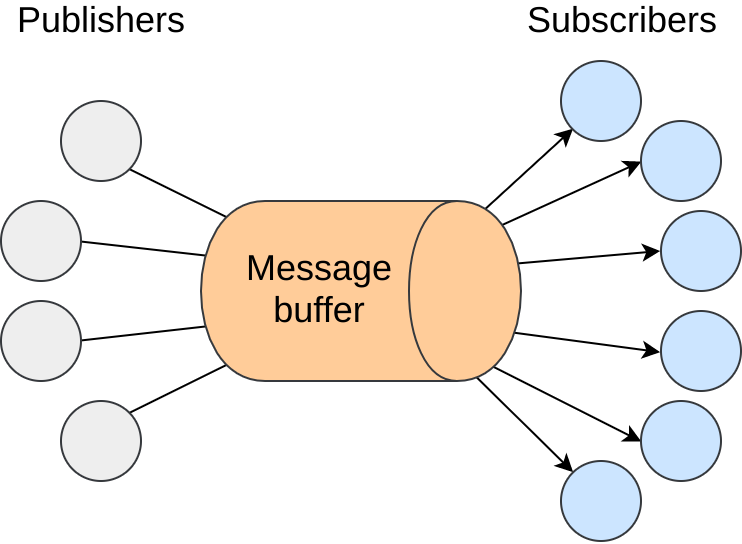

# Introduction

The publish/subscribe message pattern is an approach that has received an increasing amount of attention recently. This is mainly due to its special properties, that allow for full decoupling of all the communicating parts. First let's define what the publish/subscribe pattern is. In this interaction scheme, subscribers (or consumers) sign up for events, or classes of events, from publishers (or producers) that are subsequently asynchronously delivered. Taking a closer look at this definition you'll see that this comes hand in hand with the way information is consumed nowadays, with the exponential growth of social networks like Twitter and the usage of feeds such as RSS.

The previously discussed decoupling can be broken in three different parts. The decoupling in time, space and synchronisation.  The time decoupling comes from the fact that publishers and subscribers do not need to be interacting with each other at the same time, this means that the publisher can publish some events while the subscriber is disconnected and the subscriber can be notified of an event whose publisher is disconnected. Space decoupling gives the both parties the benefit of not needing to know each other in order to communicate, given that consumers and producers are focused on they're specific roles (consuming/producing) and don't care for who's doing what, or how many producers are for example. Synchronization decoupling is a consequence of the asynchronous nature of the pub/sub pattern, as publishers don't need to be blocked while producing events and subscribers can be asynchronously notified. The decoupling that this kind of system offers makes it the ideal candidate for very large networks that need a way to communicate in a efficient way. 

Due to properties described above, a lot of applications rely on the publish/subscribe paradigm and a lot of work as been done by companies like Twitter and LinkedIn into making these systems highly scalable, with the creation of tools like Kafka, which aim at guaranteeing low latency and high event throughput. Other examples are the multiple message queue systems like Apache Active MQ, RabbitMQ, Redis, etc. These solutions are, of course, centralised and as such suffer from all the common issues that affect centralised solutions, it's quite hard to maintain and scale these systems to a lot of clients. Peer-to-Peer networks on the other hand, have proven numerous times, that this is where they shine, with examples such as Gnutella, Skype and most recently IPFS. All of these systems are a living proof of high scalability P2P can offer.

The solution we purpose is a pub/sub module with a strong focus on reliability, delivery guarantees and data persistence, while maintaining the ability to scale to a vast number of users, using the network infrastructure we have in place today. Our goal is to overcome the shortcomings of most of the solutions in place where, either we have to rely on a centralised or hierarchic network to have such guarantees, or we need to give up on some reliability aspects in order to have a decentralised system. There's also, to the best of our knowledge, a lack of pub sub systems with such a strong focus on persistence, which is something our solution does.


=======================================
TODO
- Missing objectives
- Missing document structure
=======================================

# Related work

## Pub Sub Systems

========================================

Some general notes that outline what should be described here:

- Relevant PubSub systems and technology:
  - First approaches follow a "centralised" broker based topology.
  - Usage of network overlays as the substrate for pub/sub systems. Explain different network types and give examples.
    - On one end, structured networks, that provided reliability but were costly to maintain and couldn't cope with churn
    - On the other side, unstructured networks (such as gossip based networks), which provided high resilience to churn but lack the ability to provide reliability, with event delivery following a probabilistic best effort approach.
  - The expressiveness of the different pub/sub systems (content based, topic based, type based, etc.) and how it influences choosing the properties above.
  - Recent hybrid solutions that use multiple overlays (structured and unstructured) to bring "the best of both worlds" to the table.
  - Discuss some qualities of service. Such as persistence, order, reliability and transactions.

=======================================

### Subscription Model

When considering Pub Sub systems, there's a set of different options that will lay ground for the behaviour of the whole system. We call these options, design dimensions. Specifically, in our case, one  of the biggest decisions when designing a pub sub system is what kind of subscription model to use.The subscription model determines how will subscribers set which events they're interested in. There are three large approaches covered by relevant literature and that implementations usually follow:

  * Topic based subscriptions
  * Content based subscriptions
  * Type based subscriptions

Topic based subscriptions employs, as the name states, the notion of topics or subjects to allow peers to subscribe to relevant content. These topics are identified by keywords and can be naturally viewed as a group or a channel to which peers can send messages (publish) and receive messages (subscribe). This approach was one of the earliest models in the pub sub paradigm, with references (TODO reference to TIBCO?), mainly due to its similarity with the group communication systems already in place at the time. Some examples of the topic based approach allow to build a topic hierarchy. A specific one is using a UNIX path like approach, which allow to build topic hierarchy just like paths in a file system. Consider as an example:

```
/fruits
/fruits/citrus
/fruits/citrus/orange
```

The list above is an example of 3 topics, that act as 3 different tiers on a hierarchy. This allows for specialisation and the possibility to extend the subscription structure already in place. There exists a lot of solutions that cover the topic based subscription scenario. Specifically in the distributed/decentralised area we have solutions like Scribe (TODO reference Scribe), Bayeux (TODO reference Bayeux), Tera (TODO reference Tera) and Poldercast (TODO reference Poldercast).

The content based subscription model brought a different approach that sought to use the content of the event message itself as way to subscribers to specify the messages they were interested in (TODO reference "An Efficient Multicast Protocol for Content-Based Publish-Subscribe Systems"). Essentially, subscribers could define fields, or conditions on those same fields that would make an event part of a subscription or not. Consider the following example of a simple message and subscription, represented using JSON (TODO reference to JSON).

Message
```
{
  exchange: "Euronext Lisboa",
  company: "CTT",
  order: "buy",
  number: "100",
  price: "5.55",
}
```

Subscription
```
{
  exchange: "Euronext Lisboa",
  order: "buy",
  number: ">50",
  price: "<10",
}
```
The example above translates a subscription to a stock exchange system, where the client would receive all the event messages for buy orders of more than 50 stock actions for a maximum price of 10€. The notion of subscription is much more complex in this model, but allows for a much more powerful and accurate message filtering. Usually in order to implement this, systems rely on the definition of schemas as a way to create subscriptions. Some examples of solutions that follow a content based subscription model are Gryphon (TODO reference Gryphon), Jedi (TODO reference Jedi), Siena (TODO reference Siena), Meghdoot (TODO reference Meghdoot), Mercury (TODO reference Mercury) and Sub-2-sub (TODO reference Sub-2-sub). 

Also worth referencing is the type based subscription model. (TODO reference to Eugster). The type based model seeks to use the type scheme of a programming language without introducing a topic hierarchy. Instead it focuses on the idea that, in practice, messages part of the same topic usually are of the same type and notify the same kind of event. As such we can rely on a straightforward type-safe interpretation of messages belonging to the same topic, since most topic based systems only offer, at most, weakly typed interfaces. This, of course, comes quite handy when working with strongly typed languages such as Java and C++. One other aspect also worth mentioning is that, similar to topic based systems, the type based system also offers a notion of hierarchy through sub-typing. In this area, Hermes (TODO reference Hermes) is a reference system implemented on top of a distributed network.

While looking back at these different models its crucial to understand how they are tied to the expressiveness of the system as a whole. Choosing a topic based subscription model will allow for an easier implementation when it comes to message filtering at each node, but it will clearly affect the capabilities of the system. On the other end, a content based subscription model allows for a lot more expressiveness in subscription definition, but it makes it a lot harder to implement a scalable way of filtering messages. It's also important to note that these three categories are not strict distinct models, its quite possible to have solutions in between, such as content based filtering through the use of special topics, or content based filtering only for pre-set fields. As such, not all approaches are easy to categorise and, for some specific scenarios and systems, the line is quite thin between the multiple subscription models.

It's also interesting to look at the application space and notice that not all applications have the same expressiveness requirements. This makes the existence of multiple subscription models not only justifiable but required. Consider the example given above for a stock exchange system, these kind of applications have a need for a complex set of subscription patterns, quite different from the ones you would probably have for a chat or social media application, which would rely heavily in the notion of topics and groups. 

### Network Architecture 

Independent of the subscription model used, the system approach to the network architecture is crucial as it will, not only set the way clients interact with it, but will also determine a lot of the properties that the solution will benefit from (such as scalability, reliability, etc.).

Based on the early work of Baran (TODO ref to Paul Baran paper), one can categorize networks in centralised, decentralised and distributed.


Note that the goal of a pub/sub system is to permit the exchange of events in a asynchronous manner, with the decoupling of producers from consumers as previously discussed. This can be easily achieved using an entity which is responsible for receiving the messages from the producers, storing it and distributing it through the consumers. This is what we refer to as a centralised architecture, motivated by the need of this central entity. This is the approach adopted by a lot of the message queue systems like Apache Active MQ, RabbitMQ and Redis. The usual focus for applications relying on this kind of systems is on reliability and data consistency but with a low data throughput.



The asynchronous needs of the pub/sub paradigm also allow for a different approach on message forwarding, with both producers and consumers being responsible for storing and forwarding messages, without the need of a intermediary entity. This approach is referred to as a distributed architecture as there is no central entity that could easily become a bottleneck for the whole system. It's also commonly referred to as peer to peer architecture, for it relies on the communication between peers in the same network. (TODO reference for a distributed system). These kind of systems have a great focus on scalability and, consequently, on efficient message delivery.

Finally we have hybrid approaches to both of these extremes, were we rely on a distributed network of servers making the network topology resemble more of decentralised network as showed in figure (TODO figure number). This is the approach followed by systems like Gryphon (TODO reference for Gryphon system), Jedi (TODO reference for Jedi system) and Siena (TODO reference for Siena system), which rely on a network of broker nodes to perform the work of persisting and distributing the events in a reliable fashion.  
### Overlay structure

Working with a distributed network architecture has its own set of challenges. When we rely on the communication between peers we need a way to create and maintain links between multiple nodes in a network. Hence the overlay networks. The idea is to have a structure of logical links and nodes, independent of the physical network beneath them that actually powers the communications through. Unlike traditional layer-3 networks, the structure of these overlays is not dictated by the fairly statical physical presence and connectivity of hosts, but by logical relationships between peers. This way we have the potential to manipulate the logical network at the application level, without needing to change the network backbone that connects the nodes. This approach was key to deploy P2P applications such as (TODO give P2P application examples) on top of the existing Internet infrastructure.


In practical terms, each node maintains a view of its neighbours in the overlay network, which translates into the communication links between them. There are different approaches to the way this state is stored and maintained, with two main categories dominating the P2P ecosystem. At one end of the spectrum we have the unstructured overlay networks, where peers form a network with no clear structure or hierarchy (commonly referred to as a network mesh) with each peer connected to a subset of other nodes independent of their id, localisation, network ip address, etc.

Unstructured overlays rely on membership protocols that try to preserve a couple of key properties, such as the network diameter and its average degree. A great amount of these membership protocols use gossip based (also referred to as epidemic) approaches in order to do this. These approaches exploit properties that arise when information is disseminated in a random, or close to random, way. These probabilistic approaches help keeping the overlay connected in the event of network failures. Such example is Cyclon, a membership protocol that uses a gossip based approach to help maintain a network which resembles a random graph (TODO reference to random graph paper) in terms of degree distribution, clustering coefficient and path length. In order to do this, the approach followed by Cyclon is to, at each node, besides keeping a fixed size of neighbours (other nodes in the network), it also keeps information to when was the last time that node was contacted. Periodically, each node contacts the oldest node of its neighbours (i.e. the node which has been the longest time without being contacted) and shares with it a fixed size partial list of its neighbours, to which the contacted peer replies back with its own partial view of its neighbours. Each node updates its neighbours list with the new info (either by filling empty cache slots or by replacing entries that were sent in the previous contact). It's also worth noting that during this exchange, the node that initiated the contact will drop the contacted node of its neighbour list, as the contacted node will inversely add the node that established contact to his. This way we end up with a uniform and organic way to disseminate node information across the network. This approach is based on a technique entitled shuffling (TODO reference to shuffling).

The unstructured overlay has an interesting set of properties, such as its ability to accommodate for a highly dynamic network with a high resilience to network failures and churn (i.e. high volumes of changes in network participants). However, the lack of structure in the network usually limits the kind of queries for content one can run through. The delivery of messages in the network will always follow a probabilistic best effort approach. Finally, unstructured gossip based approaches rely on a pre-set of conditions that, if not met accordingly, may affect the whole behaviour of the system (TODO reference to "How robust are gossip-based communication protocols?"). For example, the selection of neighbours is a key aspect and should assume a random or pseudo-random fashion. If disturbed by a small set of nodes that could either be malfunctioning or behaving selfishly, the basic properties of the network like its resilience could be severely affected.

On the other end of the spectrum of overlay networks we have the structured overlay, where peers are organised according a specific structure, like a ring, a tree or a multi-dimensional space. This is usually achieved by imposing constraints on how the nodes should be organised based on their identifiers. In order to do this, a common approach is to think of the id space as a hash table to where the content should then be distributed. The distribution of content is then done based the value of the keys generated for each piece of information, keys with values close to a node id will be stored in that node. This is commonly referred to as a Distributed Hash Table (or DHT for short), since the key space is distributed across multiple nodes. For example, Chord (TODO reference to chord), one of the first examples of a DHT, organises the nodes in a ring like structure based on their id (which results from the SHA-1 hash of its ip adress). The content is then distributed in this key space, using the same hashing function to produce the content key that was used to produce the node id.


It is common for Distributed Hash Tables to have a cost of O(log(N)) (TODO need to use math notation here) in terms of number of nodes contacted to perform a search for a given key (where N is the number of nodes in the network). Chord base structure only gives us O(N), as such, Chord uses a mechanism to allow for a speedier search. At each node, an additional routing table is kept with m entries, where m is the number of bits in the key space. Each ith entry in this table will be this node's successor (next node in the ring in a clockwise direction) with an id, at least, bigger than 2^i-1 (modulo 2^m) in the key space. For example, for a node with id 8, the 4th entry will be the first node in the ring with an id larger than 16. This table, also referred to as finger table, will allow for a logarithmic search as demonstrated in Chord's specification.

Another approach is followed by Kademlia DHT (TODO reference to paper). Just as in Chord, nodes have 160 bit identifiers and content is stored in the nodes whose ids are close to the content key (160 bit identifiers too), but the way the routing tables are structured and maintained is quite different. For starters, Kademlia relies on a XOR based distance metric between 2 keys, where the distance between 2 keys is the resulting bitwise XOR operation interpreted as an integer. The XOR metric gives us an interesting set of properties. It is unidirectional (just like Chord clockwise direction) ensuring that lookups for the same key converge along the same path but, unlike Chord, it is symmetric, as such, the distance between x and y is the same as the distance between y and x. This symmetry allows Kademlia queries to give valuable insights along every node they go through, helping out in populating each node's routing table. Kademlia nodes keep contact information about each other in a list, size m where m is the number of bits used for the keys in the system, and where each entry is a list itself of maximum size k (a system wide parameter) containing all the known nodes of distance between 2^i and 2^i+1 of itself. These lists are appropriately called k-buckets and are kept sorted by time last seen (least recently seen node at the head). Whenever a node receives a message, it updates the appropriate k-bucket for the sender's node id, inserting it in the respective k-bucket or moving it to the tail of the list if he's already there. K-buckets aim at implementing a least-recently seen eviction policy, where live nodes are never removed. This stems from a careful analysis of Gnutella trace data (TODO reference to paper) where the longer a node has been up, the more likely it is to remain up another hour. Whenever a node wants to retrieve or store content it uses a recursive node lookup procedure in order to find the k closest nodes to a given key. This lookup can be run with multiple queries in parallel and, because nodes have the flexibility to forward messages to any of the k nodes in a bucket, can route for lower latency.

A completely different method is used in the Content Addressable Network DHT (TODO reference to paper). In CAN, the key space used to address the content stored in the DHT is a virtual d-dimensional Cartesian coordinate space. In order to store and retrieve content, the generated keys use a uniform hashing function that maps the key into the d-dimensional space, resulting in a point. The overall space is split into different areas referred to as zones. Each node is responsible for a zone and, consequently, for all the keys stored in that zone. Retrieving a key can be done by calculating its corresponding point in the d-dimensional space and, if the point does not belong to this node space or any of its neighbours (nodes responsible for adjacent zones) it can be routed through CAN infrastructure in order to find the node responsible for storing the key. Intuitively, routing in CAN works by following the line from the source to the destination coordinate in the Cartesian space. In practice this is done by forwarding the message to the neighbour closest to the destination coordinate. Interestingly enough, the usage of a multidimensional space as the key space for the DHT, makes the distance metric in the CAN DHT as a simple Cartesian distance between two points. 


Other popular examples in the DHT field are Pastry and Tapestry (that we kept out for the sake of simplicity, although a lot of the mechanisms described above apply to these). DHTs present a set of interesting benefits, such as good routing performance (usually logarithmic in the number of nodes), the limited size of state kept at each node (usually logarithmic routing tables), a better support for exact match and other complex queries and also present stronger guarantees on  message delivery.If the hashing function is properly selected it can also be ensured that the load is balanced properly across the network. However, these networks lack the tolerance for heavy network partitions and network churn that the usual unstructured network can bare. 

As with everything discussed so far, not every solution lies in each end of the spectrum, and overlay structure is no different. Recent research has been pushing more and more towards hybrid solutions that take advantages of both sides. Such example is Vicinity (TODO reference to paper) which employs Cyclon (discussed above) as a peer sampling service to help out in building an ideal structure that links nodes based on their proximity (for some notion of proximity, e.g. latency, localisation, etc.). The Vicinity system discusses that the usage of probabilistic mechanisms helps out in keeping an healthy and reliable structure. (TODO maybe room to reference other works, such as gocast?). 

### Subscription Management and Event Dissemination.

Now that we've set the underlying structures that power up the network, it's time to cover the specific requirements of a pub/sub system. We have two different aspects to cover, subscription management and event dissemination. By subscription management we refer to a set of key factors that will determine the overall performance of the pub/sub system, specifically in terms of matching events with subscribers, the selected representation for subscriptions, registering new subscriptions and deleting subscriptions. Event dissemination dictates how will the events be propagated through the system, in a way that doesn't burden specific nodes, but assures that all the subscription requirements are met. It's obvious that in some ways these two aspects are connected (e.g. the way we store our subscriptions will probably impose a set of restrictions in how our events will be propagated) but it's still possible to make a clear distinction between how they work and their role in the overall system. 

As we've discussed before, in order to match subscribers with publishers, some kind of state must be kept (what we refer as subscriptions). There are plenty of ways of doing this and factors like network architecture and subscription model come into play here. For a system with a centralised architecture, this isn't such a big challenge, since the central nodes will be responsible for keeping and managing the state, matching events with the correct subscribers and making sure the event propagation works accordingly. However, in a decentralised or a distributed scenario, this isn't such a trivial problem to solve.

One interesting property of topic based systems in a distributed scenario is that their subscription management and event dissemination can be easily implemented with an application level multicast system if we cluster subscribers of some topic/group in a single structure (e.g. a multicast tree). For example, consider the topic `/foobar` issued by a particular node in a pub/sub system. If , when new subscriptions are issued to this node, a tree like structure is built that allows events related to this topic to flow accordingly, disseminating a new event in `/foobar` is just a matter of sending the event to the root of the tree. From there, dissemination can flow blindly through the multiple links. Subscriptions are then represented as simple dissemination trees for each topic, which, interestingly enough, end up also representing how the actual events will be propagated in each topic. The root node acts as a rendezvous node which, as the name suggests, it's where events are targeted at and new subscriptions issued to. The core idea by relying on such nodes is that, eventually, all the system state will be synchronised (all the events will be propagated to the expected nodes and no subscription is left unattended). This doesn't mean that other nodes can't cache state though, the idea of the rendezvous is to have a basic reassurance in subscription management and event dissemination. Ideally this would be implemented in a distributed fashion, keeping as much pressure out of the rendezvous node as possible. This is the approach followed by Scribe (TODO reference to Scribe) and Bayeux (TODO reference Bayeux).

The usage of rendezvous nodes and tree like structures to represent subscriptions isn't something particular to topic based systems. There are examples of these techniques in content based systems also, specifically Gryphon (TODO reference Gryphon), Siena (TODO reference Siena) and Jedi (TODO reference Jedi). Hermes (TODO reference to Hermes) on the other hand is an example of the same mechanisms with a type based subscription model. A more detailed description of how this is done in Gryphon, Siena and Scribe will be made further along, since they have different approaches motivated by their different options in network architecture and subscription model.

For content based systems though, a common approach is to use multidimensional spaces as a way to represent subscriptions. The idea is to have each dimension refer to a specific attribute of the pub/sub schema.

```
{
  exchange: String,
  company: String,
  order: String,
  number: Integer,
  price: Float,
}
```

Considering the example above, we could map each of the given attributes to a given dimension and end up with a 5 dimensional space that we could use to route events accordingly. Meghdoot (TODO reference to Meghdoot) is an example of a content based pub/sub system that follows an approach close to this one, using a CAN DHT with 2n dimensions, where n is the number of attributes in the schema. We'll cover Meghdoot further down, but it's worth mentioning that are other alternatives to using a multidimensional space DHT to replicate this behaviour. Mercury (TODO reference Mercury) for example relies on the usage of several ring-based DHTs to recreate this multidimensional space and support range queries, using one DHT per attribute.

For topic based systems, an alternative to building dissemination trees that rely on a rendezvous nodes is to consider each different topic as separate overlay. Each set of subscriptions for a topic is then represented as a different network (which can be either structured or

A different approach to managing subscriptions and disseminating events in topic based systems is by having an overlay for each different topic. The idea is that by clustering nodes one can afford an easier event dissemination as well as an easy way of matching events with subscribers, since it's just a matter of propagating a given event inside its overlay. In order to keep everything connected, a general overlay can be used, that will allow all the nodes to have visibility on the whole set of topics. In this scenario, subscriptions are simply represented as being part of a specific network of peers, that could take any form or shape, or even be unstructured. For an unstructured network, the propagation of events could be a simple flooding algorithm, as it happens in Tera. Tera (TODO reference to Tera), a topic based pub/sub system, follows an approach close to this one. It keeps two distinct gossip based overlays, one responsible for keeping state on entrypoints for each topic (peers which are subscribed to a given topic and that can act as dissemination points for it) and another used to keep the subscribers of each topic. This clustering approach, where subscribers of a given topic are kept in a topic specific overlay, helps out in the dissemination step after an event has been published and reached the cluster. Another example following this approach is Poldercast (TODO reference to poldercast), which uses a set of three different overlays to keep the pub/sub network running. We'll cover Poldercast more thoroughly later on. 

### Systems

#### Gryphon 
Gryphon relies on a broker based network to build a content based subscription system. In the Gryphon approach, subscriptions take the form of a schema consisting of attributes, such as A1,..., An, and are stored in the form of a tree. A subscription specifying a value V1 to the first attribute of the schema, A1, will follow from the tree root the edge labeled with V1. If no such edge exists, one will be created. For Ai = Vi, the subscription will follow at level i - 1 the edge with label Vi. If a subscription does not name an attribute at level i, then it will follow the edge with label * (do not care).

(* more to add *)
(Example sketch of the subscription matching system)

#### Scribe

(* more to add *)

#### Jedi

Jedi too relies on a broker based network to build a content based pub/sub system. It developed a tree topology of broker nodes, where users were associated with leaf brokers and users’ subscriptions and events were first directed to their associated brokers. During subscription processing, subscriptions were directed up the leaf-to-root path, leaving at each intermediate node some state. During event processing, events also followed the leaf-to- root path. This guaranteed that any event and any subscription would rendezvous at (least at) the root. Any incoming event would therefore be matched against all subscriptions that have passed through each broker, this guaranteed that no subscription matching an event would go undetected. Also, while events were travelling towards the root, subscription matching could happen at each broker and events would be sent down the tree if needed be.

(* more to add *)

(Example sketch of the routing system)

#### Siena

Siena is similar to Jedi, but it forms a graph broker topology.

(* probably only keeping either Siena or Jedi *)
(* more to add *)

#### Meghdoot

(* more to add *)

#### Poldercast

(* more to add *)

## Web technologies

When building any kind of network focused system nowadays, there's no question that one should take the full potential of the web and all its relevant pieces. Browsers are a lot more complex and allow for a vast world of possibilities in terms of applications that can be built on top of it. P2P applications are no exception here. In the next sections we'll cover a set of technologies that allow for a modern distributed application to run, not only on desktops and servers we're used to, but also on browsers and other different platforms.

It's indisputable that one can't think of modern web development without speaking of Javascript (TODO reference javascript). Javascript is a lightweight, interpreted, programming language, known as the scripting language for the web. Initially created with the purpose of allowing the creation of simple interactions and animations in web pages it is now one of the main programming languages for the web (TODO reference to stack overflow survey https://insights.stackoverflow.com/survey/2017) used, not only for client side programming, but also for server side. Since Javascript has different runtimes, it became necessary to create a standardised base from which the multiple browser vendors and runtime maintainers could work with. Hence  ECMAScript (TODO reference ecmascript), the standard for the Javascript implementation. 

As it was previously said, Javascript nowadays is not restrict to browsers only. NodeJS (TODO reference to NodeJS) was the first successful implementation of a Javascript runtime, built on top of Chrome's V8 JavaScript engine (TODO reference V8), allowing to run what is commonly referred to as server side Javascript. One can write and run Javascript programs in multiple architectures and operating systems, with access to a set of common native libraries that allow to interact with relevant parts of the system (TODO reference to NodeJS API) such as network, filesystem and others. A key aspect in NodeJS was the way it choose to deal with the lack of support from Javascript for multithreading, by making use of an event loop that powers an event-driven architecture capable of asynchronous I/O.

Yet another key element in the NodeJS and Javascript ecosystem is NPM (TODO reference to NPM), its package manager. NPM was one of the main drivers of a philosophy that's deeply ingrained in the JS ecosystem which focuses on building small reusable packages that everyone can use and build on top of. This is heavily inspired by the UNIX philosophy summarised by Doug McIlroy (TODO reference?) - "Write programs that do one thing and do it well. Write programs that work together". This approach ended up being a major differentiator on how modern web applications are developed and currently NPM is one of the largest package registries in the world (TODO reference http://blog.npmjs.org/post/143451680695/how-many-npm-users-are-there). This mindset though is really important, for it allows applications to be built on top of previously published packages, making modularity and code reusability core values of the ecosystem. Even more interesting is the sudden possibility offered by having the same programming language supporting different environments (browsers, servers, desktops, etc.), all of this powered by a common way of publishing and sharing code.

When focusing specifically on P2P apps, the past years have brought together a set of new network protocols that empower communication between client browsers in a real-time fashion and also provide alternatives to TCP (TODO reference TCP). WebSockets (TODO reference to websocket) aimed at providing a real-time, full-duplex communication between clients and servers over TCP, but it was WebRTC (TODO reference webrtc) that paved the way for new P2P applications that could run in the browser. WebRTC focuses on powering real-time communications, like audio/video stream or just arbitrary data, between browsers, without the need of an intermediary. This of course is a real break through in the P2P field as it allows browsers to receive incoming connections. On other hand, alternatives to the TCP transport, such as UTP (TODO reference to UTP) and QUIC (TODO reference QUIC), came through, seeking to bring reliability and order delivery without the poor latency and congestion control issues of TCP. This provided new suitable alternatives to communication between peers on top of UDP, a transport that has been vital in P2P applications that need an affordable way to perform NAT (TODO reference NAT) traversal.

In the application realm, there have been quite a few in the past years that seek to leverage all these new technologies and breakthroughs. One of the examples most worth mentioning is the InterPlanetary File System (IPFS) (TODO reference IPFS), a P2P hypermedia protocol designed to create a persistent, content-addressable network on top of the distributed web we have today. At the core of IPFS there's what they refer to as the Merkle DAG (TODO reference to IPFS spec on the merkle dag), a graph structure were each node is addressed and can be linked to based on the hash of its content. Each node can have links to other nodes, creating a persistent, chain like, structure that's immutable. IPFS exposes an API that allows us to interact with this structure, inserting and requesting random blobs of data, files, JSON objects and other complex structures. Having implementations in both Go and Javascript, IPFS leverages the modularity mantra in a fascinating way, focusing on creating common interfaces that allow for different pieces of the architecture to be changed and selected according to one's needs, without impacting the overall application and its top level API. These came from the observation that the web we have today is a set of different heterogeneous clients, that have different needs and resources, as such not everyone can rely on the same set of transports, storage management and discovery mechanisms. These small modules that constitute IPFS have recently been brought together under the same umbrella, as libp2p (TODO reference to libp2p), a set of packages that seek to solve common challenges in p2p applications. Interestingly enough, a recent addition to libp2p, and consequently IPFS, was a pub/sub module, with a naive implementation using a simple network flooding technique.

## Systems overview

| Systems / Properties | Subscription Model | Architecture | Topology | Overlay structure | Subscription Management | Event Dissemination | Locality Awareness | Relay Free Routing | Delivery Guarantees | Fault Tolerance | Average Network Degree | Message Duplication Factor | Message Usefulness Ratio |
|----------------------|:------------------:|:------------:|:--------:|:-----------------:|:-----------------------:|:-------------------:|:------------------:|:------------------:|:-------------------:|:---------------:|:----------------------:|:--------------------------:|:------------------------:|
| Gryphon              |                    |              |          |                   |                         |                     |                    |                    |                     |                 |                        |                            |                          |
| Siena                |                    |              |          |                   |                         |                     |                    |                    |                     |                 |                        |                            |                          |
| Jedi                 |                    |              |          |                   |                         |                     |                    |                    |                     |                 |                        |                            |                          |
| Scribe               |                    |              |          |                   |                         |                     |                    |                    |                     |                 |                        |                            |                          |
| Meghdoot             |                    |              |          |                   |                         |                     |                    |                    |                     |                 |                        |                            |                          |
| Hermes               |                    |              |          |                   |                         |                     |                    |                    |                     |                 |                        |                            |                          |
| Rebecca              |                    |              |          |                   |                         |                     |                    |                    |                     |                 |                        |                            |                          |
| PastryStrings        |                    |              |          |                   |                         |                     |                    |                    |                     |                 |                        |                            |                          |
| Tera                 |                    |              |          |                   |                         |                     |                    |                    |                     |                 |                        |                            |                          |
| SpiderCast           |                    |              |          |                   |                         |                     |                    |                    |                     |                 |                        |                            |                          |
| Mercury              |                    |              |          |                   |                         |                     |                    |                    |                     |                 |                        |                            |                          |
| Sub-2-Sub            |                    |              |          |                   |                         |                     |                    |                    |                     |                 |                        |                            |                          |
| Bayeux               |                    |              |          |                   |                         |                     |                    |                    |                     |                 |                        |                            |                          |
| Poldercast           |                    |              |          |                   |                         |                     |                    |                    |                     |                 |                        |                            |                          |

Design dimensions are the design decisions that define how our system works.

- Design dimensions:
  - Subscription model (topic based, content based, etc.) - this directly affects the expressiveness of the system
  - Architecture (centralised, hierarchical, distributed, etc.)
  - Topology (in a distributed scenario, e.g. broker mesh, p2p, ...)
  - Overlay structure (the structure of the overlay(s) used - if any - where unstructered is a specific scenario)
  - Subscription management (representation, propagation?)
  - Event dissemination (routing, propagation)
  
Event dissemination and subscription management in the end might use the same mechanisms.
(?) still need to better define/separate architecture vs topology

Relevant properties are goals/special focuses that systems define as something they want to reach or give. These can be obtained by making the appropriate design decisions (see above).

- Relevant Properties:
  - Topology related:
    - Locality awareness
    - Relay free routing
  - Application related:
    - Delivery guarantees under normal conditions (when the system and network works as expected)
    - Fault tolerance mechanisms (delivery guarantees under churn, ability to keep network overlay structure when relevant nodes (or a great deal of nodes) leave the network)

Relevant metrics are metrics that are a consequence of the design decisions made above and provide a good overview on how well the solution fits a certain usage scenario.

- Relevant Metrics
  - Average network degree
  - Message duplication factor
  - Message usefulness ratio (operational msgs vs actual messages relevant for the applications)

# Purposed solution

(Oudated stuff, missing the whole solution purposed on e-mail)

## IPFS

### IPFS diagram


### P2P diagram


As per what we discussed, the desired capabilities of our system will be a highly reliable system with high robustness under churn, that uses IPLD and possibly IPNS to provide a way for events to not only be persisted but also gives the peers a way to validate their data stream and request missing blocks of information. This can power applications like document collaboration tools, or chat applications with multiple levels of threads happening at once.
(?) Need to better define the schema for the IPLD graph, since I think the way I might be seeing things might not be right.
